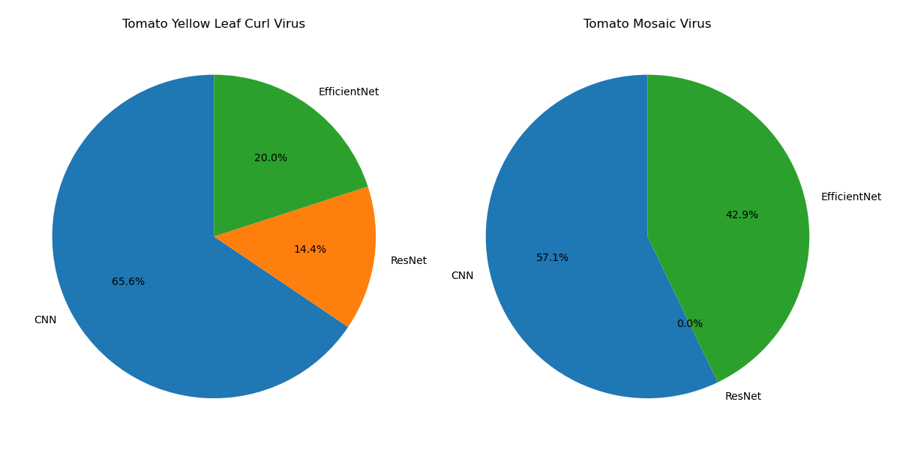

# Results and Analysis

In this section, I analyze and interpret the results obtained from my three CNN models across different tasks and explain my reasoning on which model to choose and how to optimize it in each case. At the end, I will include how I would continue this project in the future. 

## Table of Contents
- [Missclassification](#missclassification)
- [Dataset distribution](#dataset-distribution)
- [Contributing](#contributing)

## Missclassification

First, we analyze the 

## Dataset distribution

<!--

-->

## Installation
