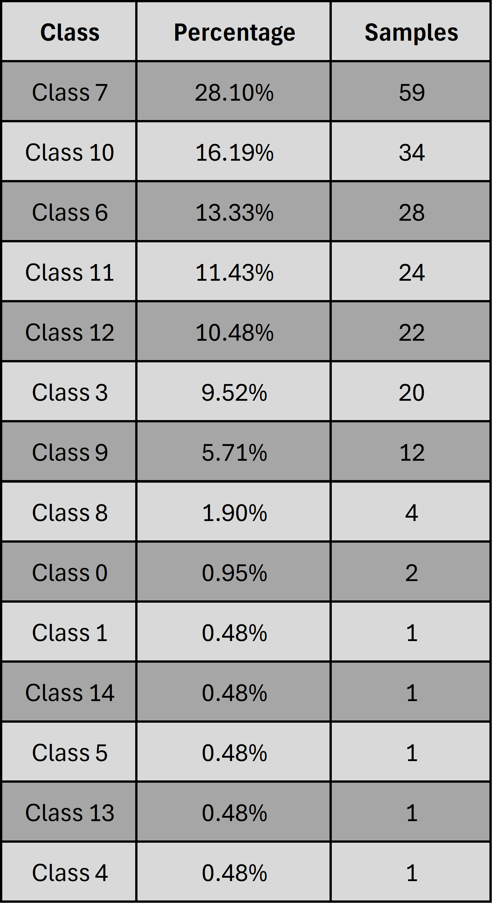
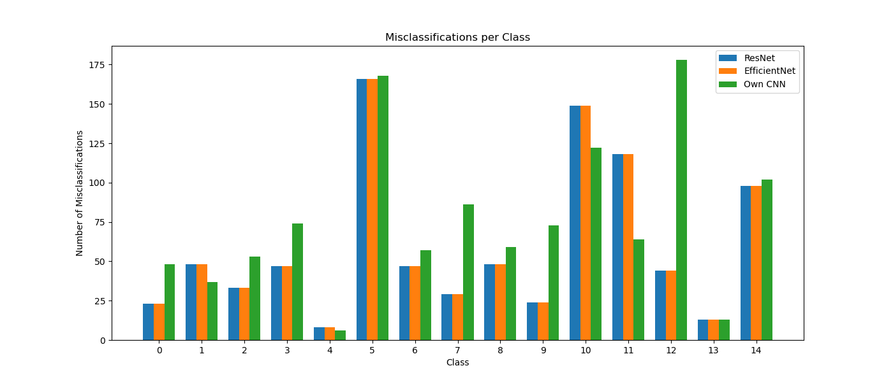

# Results and Analysis

In this section, we analyze and interpret the results obtained from my three CNN models across different tasks and explain my reasoning on which model to choose and how to optimize it in each case. At the end, I will include how I would continue this project in the future. 

## Table of Contents
- [What questions are we analysing](#what-questions-are-we-analysing)
- [Dataset Class Distribution](#dataset-class-distribution)
- [Overall model performance](#overall-model-performance)
- [Optimizing most dangerous classes](#optimizing-most-dangerous-classes)
- [User-oritented model performance](#user-oritented-model-performance)
- [Most dangerous class for user-oritented model](#most-dangerous-class-for-user-oritented-model)
- [Future improvements](#future-improvements)

### What questions are we analysing?

The main goal is to choose the model with the highest accuracy because we want a reliable, optimized model. We have three models, and we compare them and see which performs the best overall. The second question is how well does each model perform towards the two most harmful classes, and how restricted is our choice of model based on this analysis, as we don't want to encounter any false negative? The last question that I asked was, would the decision change on these previous observations with a more user-realistic approach, as all images used were high quality and specially designed for optimal results?

### Dataset Class Distribution

Before beginning to analyze each task, it is important to note that the distribution of each class is unbalanced, as seen in the figure below. Some classes, like *Potato_healthy* and *Tomato_Tomato_mosaic_virus*, are underrepresented, whereas the class *Tomato_Yellow_Curl_Virus* is overrepresented. I solved it with class_weights such that during training each class contributes with equal weight, which mitigates this imbalance. 

  

## Overall model performance 

We observe that ResNet and EfficientNet perform much better than my own constructed CNN. ResNet performs 1.6% better in the accuracy test than EfficientNet, meaning if we just look at which model performs the best, we would choose and optimize ResNet. Additionally, we notice that ResNet is more confident in these decisions than EfficientNet and my own CNN, strengthening the decision to choose the ResNet model. Furthermore, we notice that both transfer models (ResNet and EfficientNet) perform superior to my own CNN, showcasing the strength of pretrained models. It took me a while to construct an acceptable CNN, whereas with transfer learning, it took me minutes. With this in mind, if applicable, utilize transfer learning.

<table>
  <tr>
    <th>Model</th>
    <th>Accuracy</th>
    <th>Loss</th>
  </tr>
  <tr>
    <td>own CNN</td>
    <td>0.898</td>
    <td>0.407</td>
  </tr>
  <tr>
    <td>ResNet50</td>
    <td>0.967</td>
    <td>0.120</td>
  </tr>
  <tr>
    <td>EfficientNetB0</td>
    <td>0.951</td>
    <td>0.156</td>
  </tr>
</table>

*Chosen model: ResNet50*

### Analysing missclassification of each model 

The next step would be to optimize the model's performance until optimal convergence is achieved, and to do so, I investigated the misclassification and inspected how to improve this. The histogram shows how well each model does across all classes. We notice that all models behave similarly or proportionally across all classes in the sense that the misclassifications are more class-relevant than model-based. There are some outliers, meaning if we have misclassification in one model, we cannot conclude a higher probability of misclassification in the other two models. Examples of this being my own CNN (class 3), EfficientNet (class 5), and ResNet (class 12). With this conclusion, we could optimize multiple classes by optimizing one class, as they might be correlated due to different architectures/approaches which come to the same conclusion. This makes it more advantageous and also suggests that this optimization may transfer well to other architectures like transformers, as it's not model-based.

Now let's investigate how well each model is misclassified in each class, and how we could improve this, and which improvements could potentially bring the best results.

#### Model 1: My own CNN

Even though this model performs the worst out of three models, it will still be useful to have an insight into where it fails and how to improve this model. However, directly optimizing this model would be suboptimal, as it requires more work to achieve a similar performance compared to the other two models, which makes this inefficient. Nevertheless, I will provide some insight into this model and where it fails.

  
  

The first thing that stands out is the fact that the most misclassification of all classes across all my models is from my own CNN in class 7 with 28.1% with 59 misclassifications. More than a quarter of misclassifications are from class 7, so improving this aspect would improve this model drastically. If we combine classes 6, 7 and 10, it amounts to 57.6% of the overall misclassification, so improving just these three classes and optimizing them as such that all predictions are correct, would improve the model to an accuracy of 0.957, or 95.67%, which is an increase of 5% of the model's performance. This conclusion is one reason for not selecting this model, as after this optimization, it would achieve similar performance as our already pre-existing transfer learning model without optimization.

The overall process is the same for optimizing each model, but it depends on the misclassification of each model. In each case we focus on the most misclassified classes and try to optimize them. Of course, the actual cost of optimizing each class may vary, for instance how expensive each retrieval of an additional image would be. For simplification, I assume each cost is similar across all classes which is not the case, as it is easier to get an additional image of a healthy potato leaf than of a specific mosaic virus on a tomato, but we don't have that information on how expensive it would be to perform these datasets. Therefore, for this analysis, I simplify the process and decide that each costs the same in creating an additional image. Having established this fact, I would gather more images of these classes of misclassification, so in this case classes 6, 7, and 10. The question is how many images should you gather? The simple answer is to get as much as possible because the more pictures, the better the model generalizes, resulting in more accurate predictions. For the first step of image gathering, I would try to get for each of these classes as many images as our current highest class, which is Tomato_Yellow_Curl_Virus with 2566, and move from there. If getting more images isn't applicable, the next logical step would be data augmentation, meaning taking an existing image of that class and resizing, zooming, or changing contrast or brightness. This won't generalize as well as getting a new image but still will improve the model. Furthermore, there also exists a learning rate mechanisms to improve generalization in finding the global maximum, but these are already established in our models. So the best approach is to get more data or even try a different approach, as we see in the next model with transfer learning.

#### Model 2: ResNet

Analysing the misclassifcation of our first transfer learning model ResNet.

  
  

The first observation is that class 7, which had the highest misclassification for my own CNN, isn't the highest for the ResNet model. It's in fact the second. The most misclassified class was class 11 with 22.06% with 15 samples, which is a quarter of the misclassifications of my own CNN, being the highest. Talking only about the three highest misclassified classes 11, 7 and 10, we obtain 58.8% of all misclassifications, which would improve our accuracy to 0.986, or 98.64%, when all of these misclassifications are predicted correctly. This would be an increase in model performance of 1.9%. It may seem small but in fact is significant when we are working at 90 percent accuracy.

#### Model 3: EfficientNet

Analysing the misclassification of our last model EfficientNet. 

  
  

The first observation is that both ResNet and EfficientNet perform the worst on classes 11 and 7.  EfficientNet is slightly worse in comparison to ResNet, but we can conclude based on these observations that there might exist underlying similar features across multiple classes. The aforementioned classes don't have to be with each other, but there might exist such features, as both have different architectures but have similar misclassifications. So, if we improve the distinction of these features, we would be able to optimize multiple classes at once. Taking again the three highest missclassified classes 11, 7 and 9, we obtain 50.9% of all misclassifications, which would improve our accuracy to 0.976, or 97.59%, when all of these misclassifications are predicted correctly. This would be an increase in model performance of 2.5%.

### Conclusion on optimizing the three worst class misclassifications

So even when optimizing each model for the three worst class misclassifications, the result stays the same: we should continue optimizing the ResNet model. The thought process behind this is to check if one class dominates a model and if improvement could alter our answer. Interesting to note is the fact that in general, we observe that the most misclassified classes are 7 and 11, but if we look at class distribution, both classes are well represented, not over- or underrepresented, strengthening the fact again that such a multiple-class feature exists.

<table>
  <tr>
    <th>Model</th>
    <th>Accuracy</th>
  </tr>
  <tr>
    <td>own CNN</td>
    <td>0.957</td>
  </tr>
  <tr>
    <td>ResNet50</td>
    <td>0.986</td>
  </tr>
  <tr>
    <td>EfficientNetB0</td>
    <td>0.976</td>
  </tr>
</table>

*Chosen model: ResNet50*

## Optimizing most dangerous classes

In this task, we restrict our model based on it's performance on the two most dangerous classes, because we want to minimize any false negative. These two classes consist of viruses that are incurable, meaning if we don't detect these cases, we are in grave danger. With this in mind, let's choose the optimal model.

This pie chart clearly confirms that our previous model choice remains appropriate, because in both cases ResNet performs the best of all models.

*Chosen model: ResNet50*

## User-oritented model performance  

The question follows from the fact that our dataset is well-constructed and carefully organized, but this might not represent real-world images from users. Would users be able to replicate these high-quality images with similar quality such that they don't deviate much from the distribution class? So let's analyze how our choice of model would change if we adopted a more user-realistic scenario. 

#### How do I achieve this user-realistic scenario

I utilized the built-in data augmentation from TensorFlow Keras, where I flip, rotate, zoom, change contrast and brightness, and add some noise to the existing test image and observe how well each model performs on this new test set. The following images show five examples of the new test set. 

  

### What are the performances of our models with the new test set?

<table>
  <tr>
    <th>Model</th>
    <th>Accuracy</th>
    <th>Loss</th>
  </tr>
  <tr>
    <td>own CNN</td>
    <td>0.459</td>
    <td>3.496</td>
  </tr>
  <tr>
    <td>ResNet50</td>
    <td>0.556</td>
    <td>2.814</td>
  </tr>
  <tr>
    <td>EfficientNetB0</td>
    <td>0.708</td>
    <td>1.003</td>
  </tr>
</table>

We notice that across all models the performance got worse, which makes sense as this test set is based on a different distribution class. Surprisingly, EfficientNet performs the best out of all models. My initial thought was that it would get worse proportionally, which is not the case, as EfficientNet performs far superior to the other two models, in addition to having much higher confidence. This could be argued with the fact that the pre-trained weight can adapt better to augmented data. So if we had to choose a model based on a user-oriented scenario, we would choose and optimize EfficientNet.

*Chosen model: EfficientNetB0*

Let's focus now on the misclassification and do a similar analysis with the new dataset. Having seen the difference in a specific image, what is the difference in misclassification across all classes, and can we notice any patterns? 

  

 
  Original test set

 

  

 
  Augmented test set

I divided the classes into three categories: good performing, proportionally worsening, and catastrophic and tried to find any pattern or similarities in these classes for these multi-class features. 

**Good performing classes:** 4, 6, 7, 9, 13
 
These five classes did not get proportionally worse, which is surprising in relation to how much worse the other classes got. What surprises me is that the most frequent is class 7, as before with the data augmentation, was one of the two classes that had the most misclassification, and now it holds its ground and doesn't change as much with the new test set. First I thought about the size of these classes, as 4 and 13 are the most underrepresented classes, so it didn't have a lot to misclassify, making it less proportional, but then the third smallest got a lot worse. It might be true, and it's an outlier, but I assume that is not the case based on the other categorizations, because it would then also imply larger classes would get catastrophically worse, but that is not really the case. So we cannot conclude that size has a say in why it fails to classify with the new dataset. The next step was to look into their health status. We want to see some similarities, but also where we fail to make any conclusion, as this grouping concludes a healthy leaf and a virus leaf.

**Proportionally worsening classes:** 0, 1, 2, 3, 11
 
In general, these classes got proportionally worse, which was to be expected with data augmentation. Therefore, we cannot conclude anything specifically, as we know it's not size- and health-related, and it behaves as expected.

**Catastrophic classes:** 5, 8, 10, 14
 
This is the first time we can conclude something, as all classes are for the first time from the same vegetable that being tomato. This might also be because it is overrepresented in this dataset, as 10 of 15 classes are tomatoes, but what we can additionally point out is that these four classes have similar looks in my opinion. I am not a leaf expert, so I don't know if we can conclude this, but to my eye they have some similarities. This might come from the fact that they all are tomato leaves, and with the data augmentation, it got exponentially worse because they have similar attributes such that it confuses them all together.

I did not include class 12 in one of these three categories, as I am unable to categorize it. As for ResNet - proportionally worse; for EfficientNet - a good performance; and for my own CNN - catastrophically worse, so there is no common factor to identify this class.

So in the end I am not able to identify a definitve answer why it got worse based on these observations. Let's dive deeper into which classes of each model are misclassified and how to optimize them.

#### Model 1: My own CNN

Now it might make sense to utilize my own CNN, as, except for classes 9 and 12, my own CNN behaves similarly to the transfer-learned models (has not doubled the missclassification). Of course overall it performs in general worse across all models, but there also exist some classes, like classes 5, 10, and 11, where my own CNN performs the best. This comes from the fact that for generalization I already utilized a lighter data augmentation, which makes it easier to identify each class, which I did not apply to the transfer learning models. 

  
  

Lets do a similar approach as we did before with optimizing each model by the three worst-performing classes. In this case it would be classes 12, 5 and 10, we obtain 41% of all misclassifications, which would improve our accuracy to 0.681, or 68.08%, when all of these misclassifications are predicted correctly. This would be an increase in model performance of 22.18%.

#### Model 2: ResNet

Analysing the misclassification on the ResNet model.

  
  

Optimizing the three most misclassified classes, which are classes 5, 10 and 11, we obtain 48.3% of all misclassifications, which would improve our accuracy to 0.771, or 77.05%, when all of these misclassifications are predicted correctly. This would be an increase in model performance of 21.45%.

#### Model 3: EfficientNet

Analysing the misclassification on the last model - EfficientNet.

  
  

In this case it would be classes 10,5 and 11, we obtain 49.9% of all misclassifications, which would improve our accuracy to 0.854, or 85.37%, when all of these misclassifications are predicted correctly. This would be an increase in model performance of 14.57%. 

### Conclusion on optimizing the three worst class misclassifications

Likewise, in this case we observe a similar conclusion with a different test set, in the sense that when optimizing the worst class misclassifications, the result stays the same. Noteworthy, in general, we observe that the most misclassified classes are 5 and 10, which deviate from the answer of the original test set, which was 7 and 11. This might conclude that we created some multi-class feature with the new test set, as now we have two new worst-performing classes.

<table>
  <tr>
    <th>Model</th>
    <th>Accuracy</th>
  </tr>
  <tr>
    <td>own CNN</td>
    <td>0.681</td>
  </tr>
  <tr>
    <td>ResNet50</td>
    <td>0.771</td>
  </tr>
  <tr>
    <td>EfficientNetB0</td>
    <td>0.854</td>
  </tr>
</table>

*Chosen model: EfficientNetB0*

## Most dangerous class for user-oritented model

In this task, we restrict our model based on it's performance on the two most dangerous classes because we want to minimize any false negatives. These two classes consist of viruses that are incurable, meaning that if we don't detect these cases, we are in grave danger. With this in mind, let's choose the optimal model.

This pie chart does not clearly confirm which model to pick, as for *Tomato Yellow Leaf Curl Virus*, the ResNet model performs the best, whereas for *Tomato Mosaic Virus*, EfficientNet performs the best. We decide that both classes have the same weight, as both viruses are equally harmful. Computing the average of all models, we conclude that our previous model choice remains appropriate.

*Chosen model: EfficientNetB0*

## Future improvements

This concludes the analysis of this project, and depending on which dataset we are working on, we choose different models. 

### How would I continue optimizing

I do not have the resources to create new images and that is the reason why I am stopping where I currently am. I could do data augmentation but as I already applied it to my own model, there is no major improvement to be done. However, there is still optimization that can be done, like for the user-oriented scenario, to add this strong data augmentation in the training set for all models. Additionally, we might work on a trade-off with the fact that there exists some probability that the user uploads a suboptimal image. For example, every 10th images consist of a suboptimal image, and this does change in model choosing? Does the answer change if we have more suboptimal images, and where is the trade-off, as we know that, for the clean original test set, the ResNet model performs the best whereas for the user test set the EfficientNet model performs the best?

