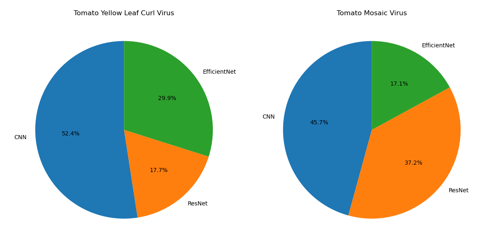

# Results and Analysis

In this section, we analyze and interpret the results obtained from my three CNN models across different tasks and explain my reasoning on which model to choose and how to optimize it in each case. At the end, I will include how I would continue this project in the future. 

## Table of Contents
- [What questions are we analysing](#what-questions-are-we-analysing)
- [Dataset Class Distribution](#dataset-class-distribution)
- [Overall model performance](#overall-model-performance)
- [Optimizing most dangerous classes](#optimizing-most-dangerous-classes)
- [User-oritented model performance](#user-oritented-model-performance)
- [Most dangerous class for user-oritented model](#most-dangerous-class-for-user-oritented-model)

### What questions are we analysing?

The main goal is to choose the model with the highest accuracy because we want a reliable, optimized model. We have three models, and we compare them and see which performs the best overall. The second question is how well does each model perform towards the two most harmful classes, and how restricted is our choice of model based on this analysis, as we don't want to encounter any false negative? The last question that I asked was, would the decision change on these previous observations with a more user-realistic approach, as all images used were high quality and specially designed for optimal results?

### Dataset Class Distribution

Before beginning to analyze each task, it is important to note that the distribution of each class is unbalanced, as seen in the figure below. Some classes, like *Potato_healthy* and *Tomato_Tomato_mosaic_virus*, are underrepresented, whereas the class *Tomato_Yellow_Curl_Virus* is overrepresented. I solved it with class_weights such that during training each class contributes with equal weight, which mitigates this imbalance. 

  

## Overall model performance 

We observe that ResNet and EfficientNet perform much better than my own constructed CNN. The ResNet performs 1.6% better in test accuracy than EfficientNet, meaning if we just look at which model performs the best, we would choose and optimize ResNet. Additionally, we notice that the ResNet is more confident in these decisions than the EfficientNet and my own CNN, strengthening the decision to choose the ResNet model. Furthermore, we notice that both transfer models (ResNet and EfficientNet) perform superior to my own CNN, showcasing the strength of pretrained models. It took me a while to construct an acceptable CNN, whereas with transfer learning, it took me minutes. With this in mind, if applicable, utilize transfer learning. 

<table>
  <tr>
    <th>Model</th>
    <th>Accuracy</th>
    <th>Loss</th>
  </tr>
  <tr>
    <td>own CNN</td>
    <td>0.898</td>
    <td>0.407</td>
  </tr>
  <tr>
    <td>ResNet50</td>
    <td>0.967</td>
    <td>0.120</td>
  </tr>
  <tr>
    <td>EfficientNetB0</td>
    <td>0.951</td>
    <td>0.156</td>
  </tr>
</table>

*Chosen model: ResNet50*

### Analysing missclassification of each model 

The next step would be to optimize model performance until optimal convergence, and to do so, I investigated the misclassification and inspected how to improve. The histogram shows how well each model does across all classes. We notice that all models behave similarly or proportionally across all classes in the sense that the misclassifications are more class-relevant than model-based. There are some outliers, meaning if we have misclassification in one model, we cannot conclude a high probability of misclassification in the other two models. Examples are my own CNN (class 3), EfficientNet (class 5), and ResNet (class 12). With this conclusion, we could optimize multiple classes by optimizing one class, as they might be correlated due to different architectures/approaches coming to the same conclusion. This makes it advantageous and also suggests that optimization may transfer well to other architectures like transformers, as it's not model-based. 

Now lets investiges how well each model missclassfied in each class and how we could improve and what improvement might bring the best results. 

#### Model 1: My own CNN

Even though this model performs the worst out of three models, it will still be useful to have an insight into where it fails and how to improve this model. However, directly optimizing this model would be suboptimal, as it requires more work to achieve a similar performance compared to the other two models, which makes this inefficient. Nevertheless, I will provide some insight on this model and where it fails.

  
  

The first thing that stands out is the fact that the most misclassification of all classes across all my models is from my own CNN on class 7 with 28.1%. More than a quarter of misclassifications are from class 7, so improving this aspect would improve this model drastically. If we combine classes 6, 7, and 10, it amounts to 57.6% of overall misclassification, so improving just these three classes and optimizing them such that all predictions are correct would improve the model to a new accuracy of 0.957, or 95.67%, which is an increase of 5% of model performance. This conclusion is one reason for not selecting this model, as after this optimization, it would achieve similar performance as our already existing transfer learning models without optimization. 

The overall process is the same for how to optimize each model, but it depends on the misclassification of each model. In each case we focus on the most misclassified classes and try to optimize them. Of course, the actual cost of optimizating each class may vary, like how expensive each gathering of an additional image would be. For simplification, I assume each cost is similar over all classes, which is not the case, as it is easier to get an additional image of a healthy potato leaf than of a specific mosaic virus on a tomato, but we don't have that information on how expensive it would be to perform these datasets. Therefore, for this analysis, I simplify the process and decide that each costs the same in creating an additional image. Having established that fact, I would gather more images of these classes of misclassification, so in this case classes 6, 7, and 10. The question is how many images should you gather? The simple answer is to get as much as possible because the more pictures, the better the model generalizes, resulting in more accurate predictions. For the first step of image gathering, I would try to get for each of these classes as many images as our current highest class, which is *Tomato_Yellow_Curl_Virus* with 2566, and move from there. If getting more images isn't applicable, the next logical step would be data augmentation, meaning taking an existing image of that class and resizing, zooming, or changing contrast or brightness. This won't generalize as well as getting a new image but still will improve the model. Furthermore, there also exist learning rate mechanisms to improve generalization in finding the global maximum, but these are already established in our models. So the best approach is to get more data or even try a different approach, as we see in the next model with transfer learning. 

#### Model 2: ResNet

  
  

#### Model 3: EfficientNet

  
  

### Optimizing most dangerous classes

## User-oritented model performance  

<table>
  <tr>
    <th>Model</th>
    <th>Accuracy</th>
    <th>Loss</th>
  </tr>
  <tr>
    <td>own CNN</td>
    <td>0.459</td>
    <td>3.496</td>
  </tr>
  <tr>
    <td>ResNet50</td>
    <td>0.556</td>
    <td>2.814</td>
  </tr>
  <tr>
    <td>EfficientNetB0</td>
    <td>0.708</td>
    <td>1.003</td>
  </tr>
</table>

*Chosen model: EfficientNetB0*

#### Model 1: My own CNN

  
  

#### Model 2: ResNet

  
  

#### Model 3: EfficientNet

  
  

## Most dangerous class for user-oritented model

